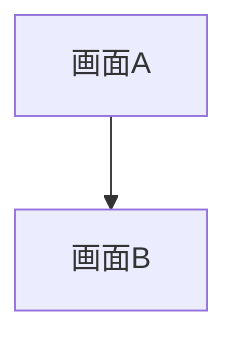
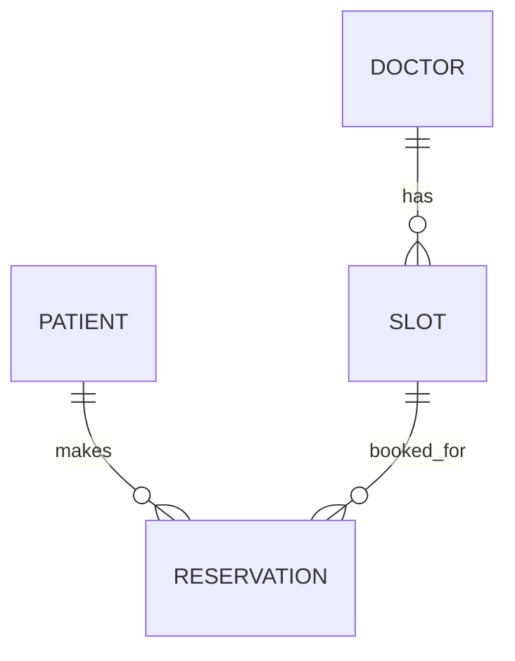

# 成果物テンプレート（チーム：＿＿＿）

# 1. 設計の対象
- システム名：
- 今回設計する主要機能：
- 想定ユーザー：

# 2. 画面設計

## 2-1. 画面一覧
| 画面名 | 利用者 | 目的 |
|------|------|------|
|  |  |  |

## 2-2. 各画面の詳細

### 画面名：
- 利用者：
- 目的：
- 入力項目：
- 表示項目：
- 主な操作：
- 遷移先：

### 画面名：
- 利用者：
- 目的：
- 入力項目：
- 表示項目：
- 主な操作：
- 遷移先：

## 2-3. 画面遷移図

# 3. データ設計

## 3-1. データ一覧

### データ名：
- 説明：
- 主な項目：
  - 項目名：
    - 型の例：
    - 必須/任意：
    - 説明：

### データ名：
- 説明：
- 主な項目：
  - 項目名：
    - 型の例：
    - 必須/任意：
    - 説明：

## 3-2. データの関係
- 例：1人の医師は複数の診療枠を持つ
- 例：1件の予約は1つの診療枠に紐づく

## 3-3. 簡易ER図

# 4. 処理設計

## 処理名：
- 利用者：
- 目的：
- 入力：
- 処理の流れ：
- 成功時の結果：
- エラー時の動作：
- 要確認事項：

## 処理名：
- 利用者：
- 目的：
- 入力：
- 処理の流れ：
- 成功時の結果：
- エラー時の動作：
- 要確認事項：

# 5. 最小API一覧（任意）
| API名 | HTTPメソッド | パス | 用途 | 主な入力 | 主な出力 |
|------|------|------|------|------|------|
|  |  |  |  |  |  |

# 6. 未確定事項
- 
- 
- 

# 7. 学び・気づき
- AIに任せてよかった点：
- 人が確認すべきだと感じた点：
- 実装前に設計して役立った点：
