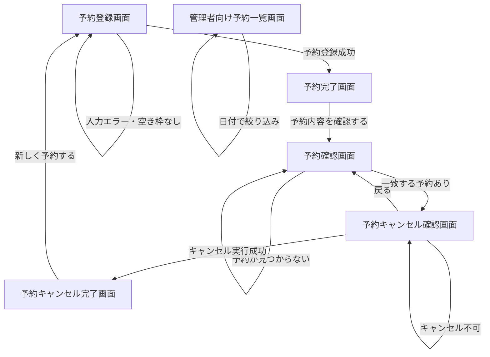
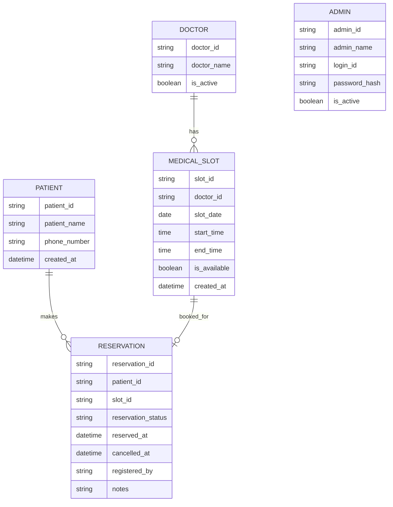

# 成果物テンプレート（チーム：Sample）

# 1. 設計の対象
- システム名：オンライン予約システム
- 今回設計する主要機能：
## 1. 予約登録機能
患者が空いている日時を選び、氏名と電話番号を入力して予約する機能です。  
30分単位の予約枠に対して、重複しないように予約を登録します。

## 2. 予約確認機能
患者が氏名と電話番号を使って、自分の予約内容を確認する機能です。  
予約日時や予約状態を確認できるようにします。

## 3. 予約キャンセル機能
患者が自分の予約を取り消す機能です。  
今回は予約を完全に削除するのではなく、**キャンセル済み**として状態を変更する形にすると設計しやすいです。

## 4. 管理者向け予約一覧機能
受付担当者・管理者が、指定した日の予約一覧を確認する機能です。  
予約を時間順に表示し、予約中かキャンセル済みかを見分けられるようにします。

- 想定ユーザー：
## 1. 患者
病院やクリニックを受診したい人です。  
自分で空いている日時を確認し、予約・確認・キャンセルを行います。

## 2. 受付担当者・管理者
予約状況を確認し、受付業務を進める人です。  
管理者向け予約一覧画面で、その日の予約状況を確認します。

# 2. 画面設計

## 2-1. 画面一覧
| 画面名 | 利用者 | 目的 |
|------|------|------|
| 予約登録画面 | 患者 | 空いている日時を選び、氏名・電話番号を入力して予約する |
| 予約完了画面 | 患者 | 予約が完了したことと、予約内容・予約IDを確認する |
| 予約確認画面 | 患者 | 氏名・電話番号を入力して自分の予約を確認する |
| 予約キャンセル確認画面 | 患者 | 確認した予約内容をもとに、キャンセルを実行する |
| 予約キャンセル完了画面 | 患者 | キャンセル完了と予約状態を確認する |
| 管理者向け予約一覧画面 | 管理者 | 指定日の予約状況を一覧で確認する |

## 2-2. 各画面の詳細

### 画面名：予約確認画面
- 利用者：患者
- 目的：氏名と電話番号で自分の予約を検索し、内容を確認する
- 入力項目：
  - 氏名
  - 電話番号
- 表示項目：
  - 画面タイトル
  - 氏名入力欄
  - 電話番号入力欄
  - 予約確認ボタン
  - 検索結果
    - 予約ID
    - 予約日
    - 予約時間
    - 氏名
    - 電話番号
    - 予約状態
  - 予約なしメッセージ
  - キャンセルボタン（予約が有効な場合のみ表示）
- 主な操作：
  - 氏名・電話番号を入力する
  - 予約確認ボタンを押す
  - 表示された予約内容を確認する
  - 必要に応じてキャンセルへ進む
- 次に遷移する画面：
  - 予約が見つかった場合：予約キャンセル確認画面
  - 見つからない場合：予約確認画面にとどまる

### 画面名：予約キャンセル確認画面
- 利用者：患者
- 目的：表示中の予約が正しいか確認したうえで、キャンセルを確定する
- 入力項目：
  - なし
- 表示項目：
  - 画面タイトル
  - 対象予約情報
    - 予約ID
    - 予約日
    - 予約時間
    - 氏名
    - 電話番号
    - 予約状態
  - キャンセル確認メッセージ
  - キャンセル実行ボタン
  - 戻るボタン
  - キャンセル不可メッセージ
- 主な操作：
  - 対象予約を確認する
  - キャンセル実行ボタンを押す
  - キャンセル不可時の案内を確認する
- 次に遷移する画面：
  - 正常時：予約キャンセル完了画面
  - キャンセル不可時：この画面にとどまる
  - 戻る操作時：予約確認画面

### 画面名：予約キャンセル完了画面
- 利用者：患者
- 目的：キャンセル完了を分かりやすく伝える
- 入力項目：
  - なし
- 表示項目：
  - キャンセル完了メッセージ
  - 対象予約情報
    - 予約ID
    - 予約日
    - 予約時間
    - 氏名
    - 電話番号
    - 予約状態（キャンセル済み）
  - 予約登録画面への案内
- 主な操作：
  - キャンセル結果を確認する
  - 必要に応じて予約登録画面へ戻る
- 次に遷移する画面：
  - 予約登録画面

### 画面名：管理者向け予約一覧画面
- 利用者：管理者
- 目的：指定日の予約状況を一覧で確認し、受付業務に使いやすくする
- 入力項目：
  - 表示対象日
- 表示項目：
  - 画面タイトル
  - 表示対象日
  - 予約件数
  - 予約一覧
    - 予約時間
    - 予約ID
    - 患者氏名
    - 電話番号
    - 予約状態
  - 予約がない場合のメッセージ
  - 日付絞り込みボタン
- 主な操作：
  - 日付を指定する
  - 一覧を表示する
  - 時間順に予約状況を確認する
- 次に遷移する画面：
  - 同一画面内で再表示

## 2-3. 画面遷移図

# 3. データ設計

## 3-1. データ一覧

### データ名：患者
- 説明：  
  予約をする人の情報です。今回は予約確認で「氏名＋電話番号」を使うため、その2つを最低限持たせます。
- 主な項目：
  - 項目名：patient_id
    - 型の例：INT / VARCHAR
    - 必須/任意：必須
    - 説明：患者を区別するためのID
  - 項目名：patient_name
    - 型の例：VARCHAR(100)
    - 必須/任意：必須
    - 説明：患者の氏名
  - 項目名：phone_number
    - 型の例：VARCHAR(20)
    - 必須/任意：必須
    - 説明：患者の電話番号
  - 項目名：created_at
    - 型の例：DATETIME
    - 必須/任意：任意
    - 説明：患者情報を登録した日時

### データ名：医師
- 説明：  
  診療を担当する医師の情報です。仕様上、医師ごとに診療枠を持つかは未確定ですが、今回の条件に合わせて最小構成で入れておきます。
- 主な項目：
  - 項目名：doctor_id
    - 型の例：INT / VARCHAR
    - 必須/任意：必須
    - 説明：医師を区別するためのID
  - 項目名：doctor_name
    - 型の例：VARCHAR(100)
    - 必須/任意：必須
    - 説明：医師の氏名
  - 項目名：is_active
    - 型の例：BOOLEAN
    - 必須/任意：任意
    - 説明：利用中の医師かどうか

### データ名：診療枠
- 説明：  
  予約できる30分単位の時間枠です。どの日の何時から何時までか、どの医師の枠かを管理します。  
  「1つの診療枠には1件だけ予約できる」というルールの中心になるデータです。
- 主な項目：
  - 項目名：slot_id
    - 型の例：INT / VARCHAR
    - 必須/任意：必須
    - 説明：診療枠を区別するためのID
  - 項目名：doctor_id
    - 型の例：INT / VARCHAR
    - 必須/任意：必須
    - 説明：この診療枠を担当する医師ID
  - 項目名：slot_date
    - 型の例：DATE
    - 必須/任意：必須
    - 説明：診療日
  - 項目名：start_time
    - 型の例：TIME
    - 必須/任意：必須
    - 説明：開始時刻
  - 項目名：end_time
    - 型の例：TIME
    - 必須/任意：必須
    - 説明：終了時刻
  - 項目名：is_available
    - 型の例：BOOLEAN
    - 必須/任意：任意
    - 説明：予約可能かどうか。実装によっては予約データから判断してもよい
  - 項目名：created_at
    - 型の例：DATETIME
    - 必須/任意：任意
    - 説明：診療枠を作成した日時

### データ名：予約
- 説明：  
  患者がどの診療枠を予約したかを表すデータです。  
  予約確認・キャンセル・管理者一覧で中心になるデータです。
- 主な項目：
  - 項目名：reservation_id
    - 型の例：INT / VARCHAR
    - 必須/任意：必須
    - 説明：予約ID。チームで決めた追加前提にあるID
  - 項目名：patient_id
    - 型の例：INT / VARCHAR
    - 必須/任意：必須
    - 説明：予約した患者ID
  - 項目名：slot_id
    - 型の例：INT / VARCHAR
    - 必須/任意：必須
    - 説明：予約した診療枠ID
  - 項目名：reservation_status
    - 型の例：VARCHAR(20)
    - 必須/任意：必須
    - 説明：予約状態。例：予約済み、キャンセル済み
  - 項目名：reserved_at
    - 型の例：DATETIME
    - 必須/任意：必須
    - 説明：予約を登録した日時
  - 項目名：cancelled_at
    - 型の例：DATETIME
    - 必須/任意：任意
    - 説明：キャンセルした日時。キャンセルしていない場合は空
  - 項目名：registered_by
    - 型の例：VARCHAR(20)
    - 必須/任意：任意
    - 説明：登録した人の区分。例：patient / admin
  - 項目名：notes
    - 型の例：VARCHAR(255)
    - 必須/任意：任意
    - 説明：補足メモ。今回は必須ではない

### データ名：管理者
- 説明：  
  管理者向け予約一覧画面を使う人の情報です。今回は権限分けは対象外ですが、「管理者だけが一覧を見られる」という仕様があるため、最小限だけ持たせます。
- 主な項目：
  - 項目名：admin_id
    - 型の例：INT / VARCHAR
    - 必須/任意：必須
    - 説明：管理者を区別するためのID
  - 項目名：admin_name
    - 型の例：VARCHAR(100)
    - 必須/任意：必須
    - 説明：管理者名
  - 項目名：login_id
    - 型の例：VARCHAR(100)
    - 必須/任意：必須
    - 説明：ログイン時に使うID
  - 項目名：password_hash
    - 型の例：VARCHAR(255)
    - 必須/任意：必須
    - 説明：パスワードそのものではなく、ハッシュ化した値を保存する想定
  - 項目名：is_active
    - 型の例：BOOLEAN
    - 必須/任意：任意
    - 説明：利用中の管理者かどうか

## 3-2. データの関係
- 患者は、予約を通して診療枠を予約します。  
  つまり、**患者1人に対して予約は複数件ありえる**関係です。

- 医師は、複数の診療枠を持つことができます。  
  たとえば、ある医師が9:00〜9:30、9:30〜10:00というように複数の枠を担当します。  
  そのため、**医師1人に対して診療枠は複数件ありえる**関係です。

- 診療枠は、予約の対象になる時間枠です。  
  今回の前提では**1つの診療枠には1件だけ予約できる**ため、  
  **診療枠1件に対して予約は最大1件**です。  
  ただし、キャンセル済みデータを残す運用にするなら、過去の履歴の扱いは実装時に要確認です。

- 予約は、患者と診療枠をつなぐ中心のデータです。  
  「どの患者が」「どの枠を」「どの状態で予約しているか」を表します。

- 管理者は予約一覧画面を見るための利用者ですが、今回の最小構成では、予約データそのものと直接ひも付けなくても運用できます。  
  ただし、将来「誰が代理登録したか」を厳密に管理したい場合は、予約に管理者IDを持たせる拡張も考えられます。

## 3-3. 簡易ER図

# 4. 処理設計

## 処理名：予約登録
- 利用者：  
  患者、受付担当者・管理者

- 目的：  
  空いている日時を選び、氏名と電話番号を入力して予約を登録するため

- 入力：  
  - 予約日  
  - 予約時間  
  - 氏名  
  - 電話番号  

- 処理の流れ：  
  1. 画面に予約可能な日付と空き時間を表示する。  
  2. 利用者が予約日と予約時間を選ぶ。  
  3. 利用者が氏名と電話番号を入力する。  
  4. システムが入力もれを確認する。  
  5. システムが電話番号の形式を確認する。  
  6. システムが選んだ日時が過去ではないか確認する。  
  7. システムがその日時にすでに予約が入っていないか確認する。  
  8. 同じ診療枠に予約がなければ、予約情報を登録する。  
  9. システムが予約IDを発行する。  
  10. その診療枠を「予約済み」にして、他の人が予約できないようにする。  
  11. 予約完了画面に、予約日時・氏名・電話番号・予約IDを表示する。  
  12. 予約確認に使う情報を案内する。  

- 成功時の結果：  
  - 予約が登録される  
  - 予約IDが発行される  
  - 選んだ日時が予約不可になる  
  - 予約完了メッセージが表示される  

- エラー時の動作：  
  - 氏名が未入力なら「氏名を入力してください」と表示する  
  - 電話番号が未入力なら「電話番号を入力してください」と表示する  
  - 電話番号の形式が正しくない場合は「電話番号の入力内容を確認してください」と表示する  
  - 日付や時間が未選択なら「予約する日時を選んでください」と表示する  
  - 過去の日時を選んだ場合は「過去の日時は予約できません」と表示する  
  - すでに予約済みの枠なら「選択した日時はすでに予約で埋まっています」と表示する  
  - 入力中に他の人が先に同じ枠を予約した場合は「先に予約されました。別の日時を選んでください」と表示する  
  - システムの問題で登録できない場合は「ただいま処理ができません」と表示する  

- 実装前に確認したいこと：  
  - 予約の確定タイミングをいつにするか  
  - 電話番号の入力ルールをどこまで厳しくするか  
  - 氏名の入力ルールをどうするか  
  - 同じ人が複数の予約を持てるか  
  - 同じ人が同じ日時で再登録しようとしたときの扱い  
  - キャンセル済みデータを残すか削除するか  
  - 予約IDを患者にどう案内するか  
  - 医師ごとの診療枠を持つかは要確認

## 処理名：予約確認
- 利用者：  
  患者

- 目的：  
  自分が登録した予約内容を確認するため

- 入力：  
  - 氏名  
  - 電話番号  

- 処理の流れ：  
  1. 画面に氏名入力欄と電話番号入力欄を表示する。  
  2. 利用者が氏名と電話番号を入力する。  
  3. 利用者が予約確認ボタンを押す。  
  4. システムが入力もれを確認する。  
  5. システムが電話番号の形式を確認する。  
  6. システムが氏名と電話番号に一致する予約を探す。  
  7. 一致する予約があれば、予約内容を表示する。  
  8. 表示する内容は、予約日・予約時間・氏名・電話番号・予約状態・予約IDとする。  
  9. 予約が有効なら、キャンセル操作へ進めるようにする。  

- 成功時の結果：  
  - 入力した情報に一致する予約内容が表示される  
  - 予約状態を確認できる  
  - 必要ならキャンセル操作へ進める  

- エラー時の動作：  
  - 氏名が未入力なら「氏名を入力してください」と表示する  
  - 電話番号が未入力なら「電話番号を入力してください」と表示する  
  - 電話番号の形式が正しくない場合は「電話番号の入力内容を確認してください」と表示する  
  - 一致する予約が見つからない場合は「入力された情報に一致する予約が見つかりませんでした」と表示する  
  - システムの問題で確認できない場合は「ただいま処理ができません」と表示する  

- 実装前に確認したいこと：  
  - 氏名と電話番号だけで本人確認として十分か  
  - 同じ氏名・同じ電話番号で複数予約がある場合の表示方法  
  - 過去の予約も表示するか、今後の予約だけ表示するか  
  - キャンセル済みの予約を表示するか  
  - 予約IDも入力条件に含めるかは要確認

## 処理名：予約キャンセル
- 利用者：  
  患者

- 目的：  
  登録済みの予約を取り消すため

- 入力：  
  - 基本は予約確認で表示した対象予約  
  - 必要に応じてキャンセル確定ボタン  
  - 氏名と電話番号で本人確認する運用

- 処理の流れ：  
  1. 利用者が予約確認画面で自分の予約を表示する。  
  2. システムが対象予約の内容を表示する。  
  3. 利用者がキャンセルボタンを押す。  
  4. システムが「本当にキャンセルしますか」と確認メッセージを表示する。  
  5. 利用者がキャンセルを確定する。  
  6. システムが対象予約が存在するか確認する。  
  7. システムがその予約がまだキャンセルされていないか確認する。  
  8. キャンセル期限がある場合は、期限内かどうか確認する。  
  9. 条件を満たしていれば、予約状態を「キャンセル済み」に更新する。  
  10. その診療枠を再び予約可能にする。  
  11. キャンセル完了メッセージを表示する。  

- 成功時の結果：  
  - 予約状態がキャンセル済みになる  
  - その時間枠が再び空き枠として使えるようになる  
  - キャンセル完了メッセージが表示される  

- エラー時の動作：  
  - 対象予約が見つからない場合は「キャンセルできる予約が見つかりませんでした」と表示する  
  - すでにキャンセル済みなら「この予約はすでにキャンセルされています」と表示する  
  - キャンセル期限を過ぎている場合は「この予約は取り消しできません」と表示する  
  - 本人確認ができない場合は予約を表示せず、キャンセルもできないようにする  
  - システムの問題で処理できない場合は「ただいま処理ができません」と表示する  

- 実装前に確認したいこと：  
  - キャンセル済みデータを削除するのか、状態だけ変更して残すのか  
  - キャンセル可能期限を設けるか  
  - キャンセル後に患者へ再表示する内容  
  - キャンセル済み予約を予約確認画面に出すか  
  - 予約IDを使ってより確実にキャンセルできるようにするかは要確認

## 処理名：予約一覧表示
- 利用者：  
  管理者

- 目的：  
  指定した日付の予約状況を一覧で確認するため

- 入力：  
  - 日付  
  - 必要に応じて絞り込み条件  

- 処理の流れ：  
  1. 管理者が予約一覧画面を開く。  
  2. システムが管理者かどうか確認する。  
  3. 画面に日付の入力欄や検索ボタンを表示する。  
  4. 管理者が確認したい日付を入力または選択する。  
  5. 管理者が一覧表示ボタンを押す。  
  6. システムが指定した日付の予約データを取り出す。  
  7. 予約データを時間順に並べる。  
  8. 一覧に、予約時間・患者氏名・電話番号・予約状態を表示する。  
  9. キャンセル済みの予約がある場合は、予約中と区別して表示する。  
  10. 予約件数もあわせて表示する。  
  11. 該当データがなければ、そのことを画面に表示する。  

- 成功時の結果：  
  - 指定日の予約一覧が時間順で表示される  
  - 予約中かキャンセル済みかを見分けられる  
  - 受付業務で当日の状況を確認しやすくなる  

- エラー時の動作：  
  - 管理者以外が開こうとした場合は「この画面は管理者のみ利用できます」と表示する  
  - 指定日に予約が1件もない場合は「本日の予約はありません」または「指定した条件に一致する予約はありません」と表示する  
  - 日付が未入力の場合は、日付入力を促すメッセージを表示する  
  - システムの問題で一覧表示できない場合は「ただいま処理ができません」と表示する  

- 実装前に確認したいこと：  
  - 一覧表示の対象を当日分だけにするか、他の日付も見られるようにするか  
  - 管理者画面に表示する項目をどこまでにするか  
  - キャンセル済み予約を一覧に含めるか  
  - 日付以外の絞り込みを入れるか  
  - 管理者の権限分けをするかは要確認  
  - 医師ごとに予約枠を分ける場合の表示方法は要確認 

# 6. 未確定事項
- 
- 
- 

# 7. 学び・気づき
- AIに任せてよかった点：
 - 自分だけでは思いつきにくい観点まで含めて、画面設計・データ設計・処理設計を整理できた
 - 予約登録だけでなく、予約確認・予約キャンセル・管理者向け予約一覧までまとめて整理できた
- 人が確認すべきだと感じた点：
 - 氏名と電話番号だけで本人確認として十分かどうかは、人が判断する必要がある
 - 同じ人が複数予約できるか、同じ日時で再登録できるかなどの運用ルールは人が決める必要がある
- 実装前に設計して役立った点：
 - 実装に入る前に、必要な画面・データ・処理の流れを整理できた
 - 予約機能は単純に見えても、重複予約防止やキャンセル処理など考えることが多いと事前に気づけた
